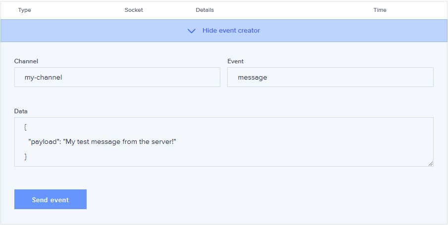

## Overview

Have you ever wanted to level up an application by allowing users to collaborate on live data together or notifying them of data changes in realtime? With a standard REST backend implementation, the user would have to refresh the page to fetch the latest or you could implement polling. In this post we'll explore how to support this in a React application in a way that scales efficiently.

## Polling

Polling, a method used to continuously check for new data, might not cut it if that change in state is vital and should be presented to the user almost immediately. There's manual polling, where the user can refresh the page as he or she chooses, checking for the updated state. Or the application can have a timer scheduled to fetch for new data at some frequency. How do you pick the perfect timer interval anyway? Would you rather make too many API calls to the server (does that scale well as your user base increases to 100, 1000 or more)? Or keep the user missing out on the updated data for those few extra moments? Remember the days of hammering the F5 key to see the updated price you were bidding on over at [eBay](https://ebay.com)?

## Websockets

Enter websockets, where a persistent connection is created between the client and server allowing data to flow freely in both directions. There are several services available providing this technology such as [Pusher](https://pusher.com), [Socket.IO](https://socket.io) and [Firebase](https://firebase.google.com). Pusher is the service I chose to use because it provides a simple messaging API to achieve this in your application. They offer a [Sandbox Plan](https://pusher.com/channels/pricing) for their Channels API for free (100 connections max, unlimited channels, 200k messages/day) and have a great debug console which makes things a breeze when trying to test this functionality in your app.

## Getting Started

[Sign up](https://dashboard.pusher.com/accounts/sign_up) to Pusher (they make it simple via GitHub). They'll walk you through setting up your first Channels app, generating your App Keys, giving you some example JavaScript to use and get you access to the debug console. The console will allow us to send server messages to listening clients without building and deploying a backend. Install Pusher via `npm install --save pusher-js` as a dependency to your project and you're ready to build your first realtime component.

## Pusher Basics

Most Pusher tutorials (and I believe Socket.IO but am not as familiar with the implementation) will have you connect to the socket in `componentDidMount`. Then you subscribe to your channel, which you can think of as a chat room of where certain messages will be sent to. Your component can join any number of channels using the same or different websocket connection. Then you set up your event handlers for a channel to do your updates, probably setting new state, for certain events. Your application will re-render right in front of the user, no timer, no manual refresh. Pretty simple, right? And it works. Use the Debug Console pictured below to send your listening client some realtime messages.

```javascript
// src/PusherExample.js
import React from "react"
import Pusher from "pusher-js"

export default class PusherExample extends React.Component {
  state = {
    messages: [],
  }

  componentDidMount() {
    // Replace APP_KEY and APP_CLUSTER with your Pusher app specific keys
    this.pusher = new Pusher("APP_KEY", {
      cluster: "APP_CLUSTER",
      encrypted: true,
    })

    this.channel = this.pusher.subscribe("my-channel")

    this.channel.bind("message", this.messageEventHandler)
  }

  componentWillUnmount() {
    this.channel.unbind()
    this.pusher.unsubscribe(this.channel)
    this.pusher.disconnect()
  }

  messageEventHandler = data => {
    this.setState({ messages: [...this.state.messages, data.payload] })
  }

  render() {
    return (
      <div className="App">
        <header>
          <h1>Welcome to React-Pusher Chat</h1>
        </header>
        <ul>
          {this.state.messages.map((msg, index) => (
            <li key={`msg-${index}`}>{msg}</li>
          ))}
        </ul>
      </div>
    )
  }
}
```



Alright so we have data flying in realtime, but how does this scale in a large application? Let's say we have three silos in a Todo app - pending, in progress and completed. You might have three separate components for the sake of this tutorial. It wouldn't be necessary to open three Pusher connections for this one user. And if the user is me, who has a browser tab problem, he or she will have several of them open. Now what, 2 tabs, 3 connections per, you're up to 6, when in reality the client can listen to multiple channels (or single channel and multiple event names, however you want to slice it) using a single websocket connection. This can be achieved with React's [Context API](https://reactjs.org/docs/context.html).

## Single Pusher Connection with React Context

If you're not familiar with Context, you should read Kent C. Dodd's post, [Application State Management with React](https://kentcdodds.com/blog/application-state-management-with-react) to get a good handle on how you can share state across components. We can reuse our Pusher connection by creating a PusherProvider around our application component. The Pusher object is created once during the initialization of the app and passed into the context as the default value.

```jsx
// src/App.js
import React from "react"
import Pusher from "pusher-js"
import { PUSHER_CONFIG } from "./config/pusher.config"
import "./App.css"
import { PusherProvider } from "./PusherContext"
import { Child } from "./Child"

// Enable pusher logging - don't include this in production
Pusher.logToConsole = true

// Set up pusher instance with main channel subscription
// Be able to subscribe to the same channel in another component
// with separate callback but utilizing the existing connection
const pusher = new Pusher(PUSHER_CONFIG.key, {
  cluster: PUSHER_CONFIG.cluster,
  forceTLS: true,
})

function App() {
  return (
    <PusherProvider pusher={pusher}>
      <div className="App">
        <header className="App-header">Context API w/ Pusher real-time</header>
        <main className="App-main">
          <span>Put some main component here</span>
          <Child />
        </main>
      </div>
    </PusherProvider>
  )
}

export default App
```

```jsx
// src/Child.js
import React from "react"
import { usePusher } from "./PusherContext"

function Child() {
  // Use the pusher hook to get the pusher instance from context
  const pusher = usePusher()
  const [messages, setMessages] = React.useState([])

  // Set up the side effect, each time a message comes in
  // on the child-channel with an event type 'child-event',
  // add the payload to the messages array
  React.useEffect(
    () => {
      function messageEventHandler(data) {
        const newMessages = [...messages, data.payload]
        setMessages(newMessages)
      }

      const channel = pusher.subscribe("my-channel")
      channel.bind("message", messageEventHandler)

      return () => {
        channel.unbind("message", messageEventHandler)
      }
    },
    [messages, pusher],
  )

  // Render the messages down below
  return (
    <div className="child">
      <span>
        A child component here, using a pusher connection initialized in some
        parent!
      </span>
      <ul>
        {messages.map((msg, index) => (
          <li key={`child-event-${index}`}>{msg}</li>
        ))}
      </ul>
    </div>
  )
}

export { Child }
```

Now some child component can subscribe to a channel using the already open Pusher connection. Setup and cleanup your event handlers as you normally would. Now you're user is down to a single connection, which goes a long way for our Sandbox plan! You can see more details at the [example repository](https://github.com/frankcalise/react-context-pusher).

## Further Enhancements

So how else can we improve this implementation? We can combine Context with useReducer so a feature made up of related components can react to our data streaming in realtime. I'll save that topic as a follow up to this post.

Another feature to look into would be using a shared worker, which can use a single connection per browser window! Even better than one per tab. Pusher has a [blog post](https://blog.pusher.com/reduce-websocket-connections-with-shared-workers/) about this implementation if this interests you.

Hopefully this post gives you a little more insight to implementing realtime functionality in a large scale React application.
