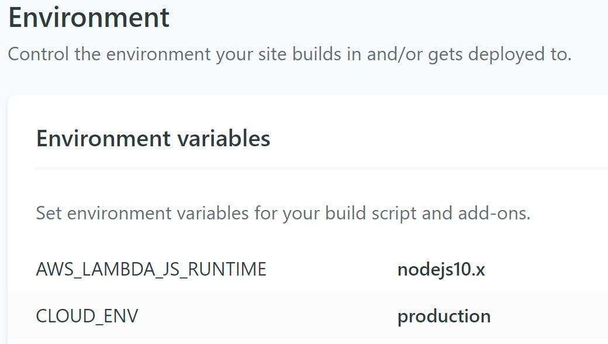

Recently I was working on a project utilizing [Gatsby](https://www.gatsbyjs.org), [Netlify Functions](https://www.netlify.com/products/functions/) and [Firebase](https://firebase.google.com/) (although, more specifically, Firestore). First there is some initial configuration to do when using Netlify Lambda and the Firebase SDK, as per their [documentation](https://github.com/netlify/netlify-lambda/blob/master/README.md). Install the required dev package via `npm install --save-dev webpack-node-externals`. Then, create a directory in the root of your project called `config` with the file `webpack.functions.js`.

```javascript
//./config/webpack.functions.js
const nodeExternals = require('webpack-node-externals');

module.exports = {
  externals: [nodeExternals()],
};
```

Let's also modify our package.json script to run our lambda functions:

```json
{
  // ...
  "scripts": {
    "start:lambda": "netlify-lambda serve --config ./config/webpack.functions.js src/lambda",
  }
}
```

After setting this up you can get going with your serverless functions. At first glance, my functions connecting to my Firestore data source worked.

Ship it, right?

Not quite. It worked until you hit the an endpoint more than a single time. Making a few more requests made me realize I encountered this error:

> **Firebase App named '[DEFAULT]' already exists.**

After doing some digging, I learned Firebase was trying to be initialized in each cloud function. 


```javascript
const admin = require("firebase-admin");
const serviceAccount =: require("./firebase.json");
admin.initializeApp({
  credential: admin.credential.cert(serviceAccount)
})

// go on to use, query, etc. 
// admin
//   .firestore()
//   .collection(`users`)
//  .get();
```

But there is a way to solve this. We can initialize Firebase a single time in a helper module, that all of our cloud functions have access to. Then use that instance in any number of cloud functions later on.

```javascript
// config/firebase.js
const admin = require("firebase-admin");
const serviceAccount = require("./firebase.json");
const app = !admin.apps.length
  ? admin.initializeApp({
      credential: admin.credential.cert(serviceAccount)
    })
  : admin.app();

export default app

// and consume later on, for example
// src/lambda/update-customer.js
import firebase from "../config/firebase";
```

Ahhh... perfetto! Crisis averted. What's going on here? We use the `apps` property and check the length of the array. If we have an app initialized already, just return the instance, otherwise we'll go through the initialization. However, not all is well just yet. Currently, when running locally or in the cloud when deployed to Netlify, we are running against our production Firebase database all the time. Let's fix that. To improve our setup (to hit dev when running locally) it requires some enhancements to our module as well as configuration in Netlify's dashboard.

Navigate to your site's Environment settings under the "Build & deploy" tab (or head to app.netlify.com/sites/YOUR_SITE_HERE/settings/deploys#environment). Add an environment variable, I called mine, `CLOUD_ENV` and gave it the value of `production`.



Then over in my `package.json`, I edited my lambda start script to include this variable on the command line. To do this, we'll have to first install [Kent's](https://kentcdodds.com) `cross-env` package. Fire away with `npm install --save cross-env`. Next, modify your script with the environment variable and value:

```json
{
  // ...
  "scripts": {
    "start:lambda": "cross-env CLOUD_ENV=development URL=http://localhost:9000 netlify-lambda serve --config ./config/webpack.functions.js src/lambda",
  }
}
```

Sweet, we're all set. Now when you test your cloud functions locally, you'll query and manipulate your Firestore documents against some development database you have set up. Push your changes to master (from a pull request, of course), Netlify will deploy to prod for you and automatically point to the right data source.

Hope this helps!